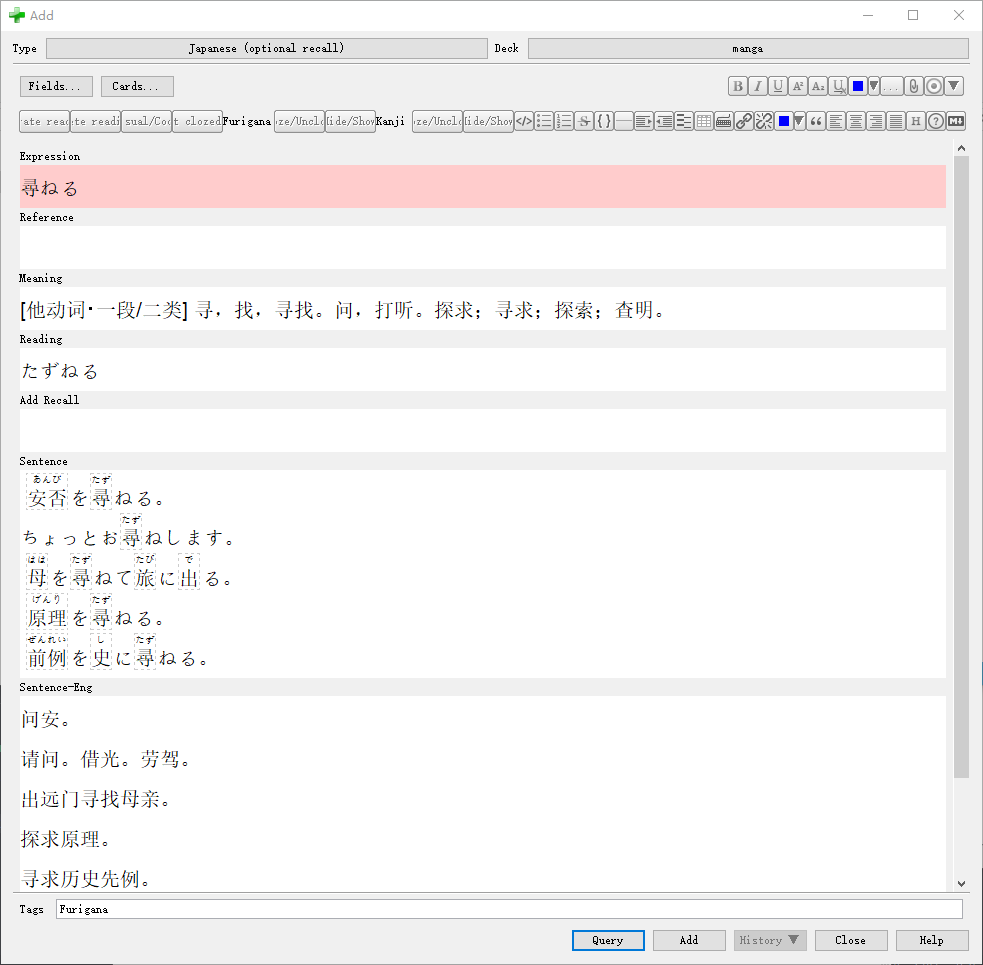
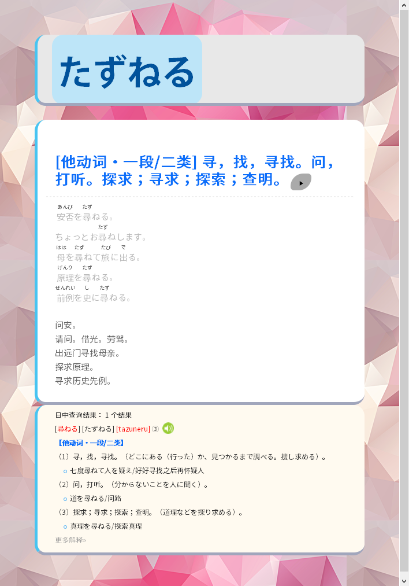

# ANKI插件word query用service

用于提取沪江小D 日中翻译

日中词典mdx格式的目前都不是缺内容就是搜索功能不行，epwing的词典，国内做的小学馆日中字典没法用yomichan的导出工具导出。于是写了这个简陋service。

代码非常烂，只为凑合能用，没学过python，全部靠github、so上复制粘贴，参考了和。

原本打算爬weblio的在线词典，看了下新版沪江似乎在日中方面更好。

用法参考word query文档

例句和例句释义分开2个field是为了添加振假名方便，

如图，分在2个field点一下就能转换。

在例句有超过4，5句时很难看，有需要的话例句和例句释义做在一个field

附上自己抄来抄去做的Note，除了word query填写的栏目外，还有结合平时看的漫画、新闻、影视作品时截图的引用栏（用于映射法背单词），卡牌背面还添加了[沪江懒人模板](https://zhuanlan.zhihu.com/p/24902283)的脚本，当初是用epwing的字典手动导的，所以加了这个，现在用了word query似乎没必要了，唯一的区别是沪江懒人模板是老的hjenglish.com，我用的是hjdict.com，之前对比我新的似乎高级点。
